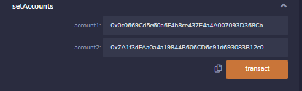
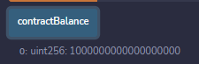
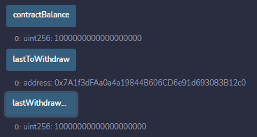
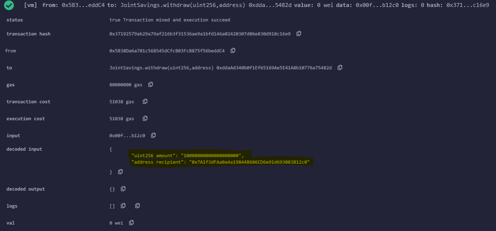

# Smart Contracts
UNCC Online FinTech Bootcamp Module 20 Challenge due by 11:59pm 4/24/2022

Image from [blockchain.news](https://blockchain.news/news/what-are-smart-contracts-and-why-are-they-important)

---

## Background

A fintech startup company has recently hired us. This company is disrupting the finance industry with its own cross-border, Ethereum-compatible blockchain that connects financial institutions. Currently, the team is building smart contracts to automate many of the institutions’ financial processes and features, such as hosting joint savings accounts.

To automate the creation of joint savings accounts, we’ll create a Solidity smart contract that accepts two user addresses. These addresses will be able to control a joint savings account. Our smart contract will use ether management functions to implement a financial institution’s requirements for providing the features of the joint savings account. These features will consist of the ability to deposit and withdraw funds from the account.

---

## What's Being Created

 1. The completed Solidity `JointSavings` smart contract.

 2. A folder named `Execution_Results` that contains at least eight images. These images should confirm that the deposit and withdrawal transactions, which are designed to test the `JointSavings` functionality in the JavaScript VM, worked as expected.

---

## Technologies

This application is written in Solidity with [Remix 0.22.2 IDE](https://remix-ide.readthedocs.io/en/latest/index.html)
  
---

## Usage

Here are some examples of successful execution of the JointSavings contract. More screenshots are located in the [`Execution_Results`](Execution_Results) folder above.

##### 1. The `JointSavings` accountholders' addresses are set:

##### 2. Our first deposit to the contract:

##### 3. Withdrawal of 10 ether from the contract to `accountTwo`:

##### 4. Example of transaction confirmation:

---

## Contributors
Geoff Tarleton - jobeycat@protonmail.com

adapted from Starter Code supplied by UNCC FinTech Online Bootcamp by Trilogy Educational Services, a 2U, Inc. brand.

---

## License

[MIT](LICENSE)
